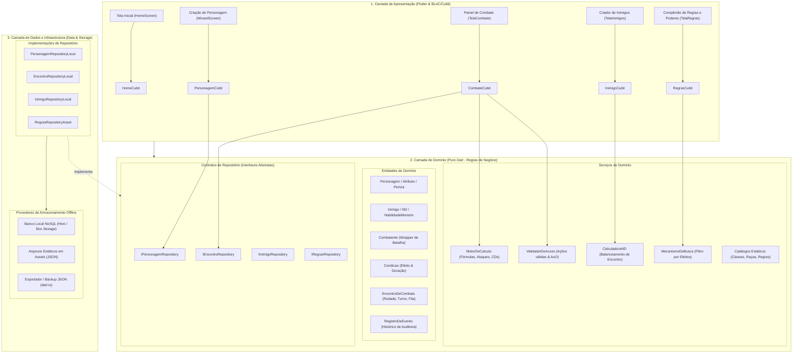
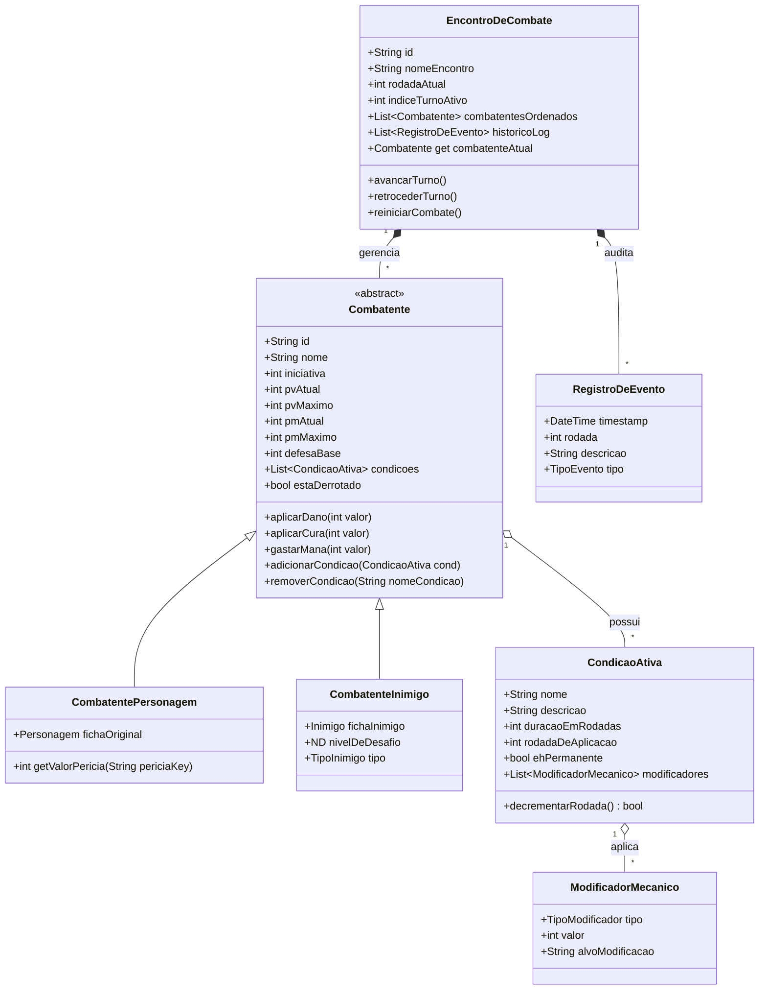
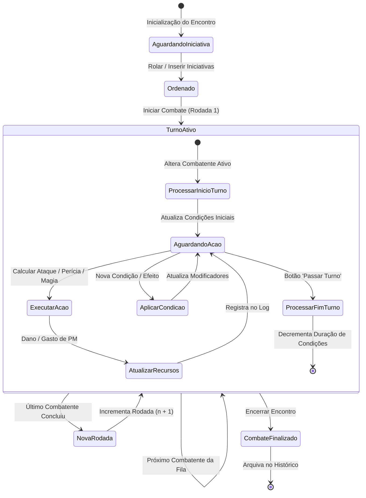
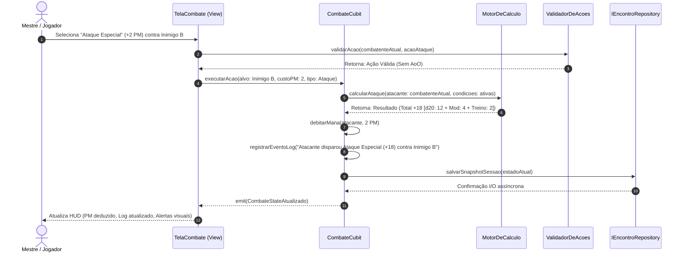
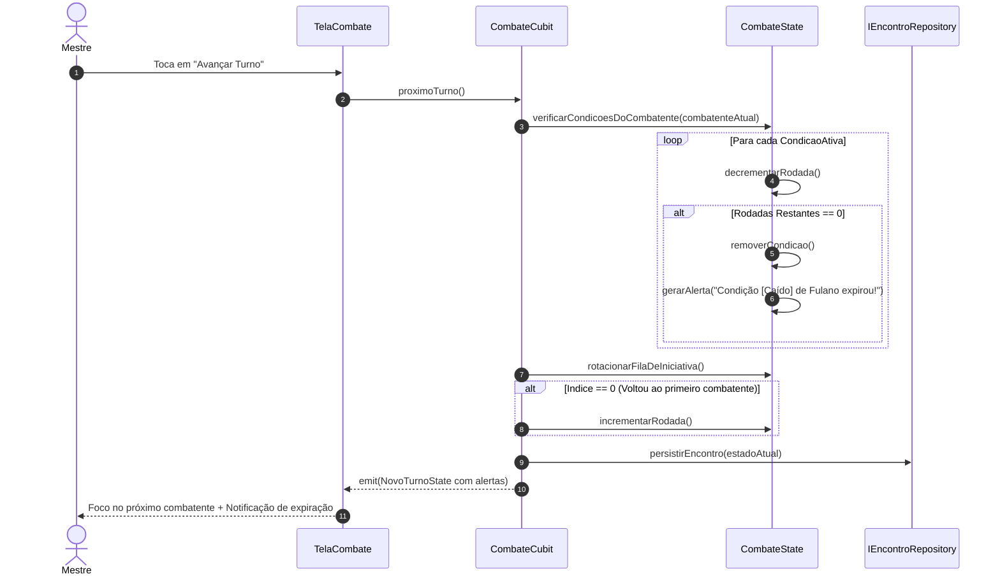
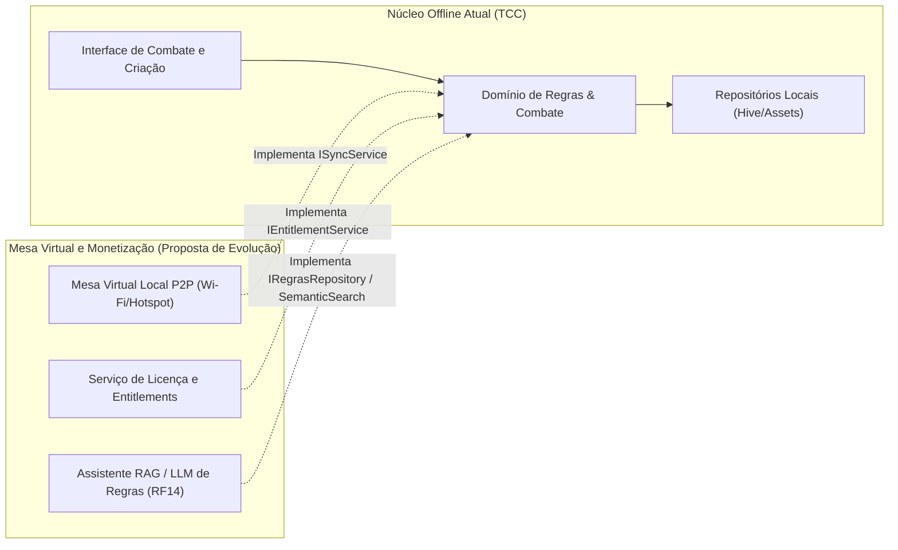

# Arquitetura de Software e System Design: Módulo de Combate e Suporte Offline (T20 Creator)

Este documento apresenta a especificação técnica e arquitetural do projeto **T20 Creator**, expandido para contemplar o **Módulo de Combate, Gestão de Adversários, Compêndio de Regras e Persistência Local**. O texto foi estruturado segundo padrões acadêmicos e de engenharia de software para servir como base formal do capítulo de Arquitetura e *System Design* do Trabalho de Conclusão de Curso (TCC).

---

## 1. Introdução e Visão Geral do Sistema

### 1.1. Contexto e Motivação
O sistema de RPG de mesa *Tormenta 20* (T20) caracteriza-se por um combate tático e dinâmico, baseado em uma miríade de variáveis interdependentes: cálculo de atributos, bônus de treinamento escalonados por patamar de nível, penalidades de armadura, custos de Pontos de Mana (PM), rastreamento contínuo de Pontos de Vida (PV), além de um rico ecossistema de condições de combate (*Caído*, *Abalado*, *Fascinado*, *Cego*, *Vulnerável*, entre dezenas de outras) dotadas de durações finitas e regras de acúmulo estritas.

Durante as sessões presenciais ou remotas, o Mestre do Jogo (MJ) e os jogadores enfrentam uma expressiva **sobrecarga cognitiva** (*cognitive overload*). O Mestre precisa simultaneamente interpretar personagens coadjuvantes, orquestrar múltiplos adversários com fichas assimétricas, calcular manualmente fórmulas matemáticas sob pressão de tempo e fiscalizar o cumprimento das regras e das durações de efeitos de cada combatente na rodada.

### 1.2. Fundamentação na Literatura e Evidências Empíricas
A proposta deste sistema ancora-se na síntese de quatro fontes estruturadas de dados coletadas durante a pesquisa:
1. **Levantamento de campo:** Respostas quantitativas e qualitativas de formulários aplicados a jogadores e mestres ativos de Tormenta 20 (`respostas.xlsx`).
2. **Análise empírica de sessões reais:** Três auditorias independentes da transcrição de uma sessão de jogo real sob abordagens analíticas distintas (*zero-shot*, RAG e *one-shot* — `R_zero.txt`, `R_rag.txt`, `R_one.txt`), as quais demonstraram empiricamente que a interrupção do fluxo narrativo e o estresse do mestre concentram-se na consulta fragmentada de manuais e no rastreamento aritmético do combate.
3. **Revisão Sistemática da Literatura (RSL):** Mapeamento do estado da arte sobre Sistemas Multiagentes (SMA) e Sistemas de Suporte à Decisão (SSD) aplicados a RPGs (`Dados_RSL.txt`).

A literatura recente destaca o aplicativo *Aboleth* (Chang et al., 2024), demonstrando que a automação determinística de cálculos e a hierarquização visual de dados operam como potentes redutores de carga mental, preservando a agilidade da mesa. Em contrapartida, sistemas baseados em inteligência artificial generativa ou múltiplos agentes autônomos complexos (como *SENNA* e *PAYADOR*) sofrem com latência de resposta, imprevisibilidade de regras (*alucinações*) e forte dependência de conectividade externa. 

Dessa forma, este projeto estabelece como tese de engenharia um **Sistema de Suporte à Decisão (SSD) Determinístico, Reativo e 100% Offline**, relegando arquiteturas generativas/RAG a camadas de extensão futura desacopladas.

### 1.3. O Desafio da Operação Integralmente Offline
Uma restrição não negociável para o sistema é o **funcionamento autônomo offline**:
* A esmagadora maioria das mesas de RPG presenciais ocorre em ambientes domésticos ou locais com conectividade instável, oscilante ou inexistente.
* A latência de requisições de rede durante um combate em tempo real quebra o ritmo imersivo da narrativa.
* Toda a base de regras canônicas, catálogos de classes, raças, poderes, magias, condições e algoritmos matemáticos deve residir e ser processada localmente no dispositivo do usuário, garantindo inicialização imediata e tempo de resposta inferior a 16 milissegundos por ação.

---

## 2. Análise da Arquitetura Atual do Projeto

### 2.1. Diagnóstico do Código-Fonte Atual (`t20_creator`)
O aplicativo atual foi desenvolvido no ecossistema **Flutter / Dart** e atende primariamente ao fluxo guiado (*wizard*) de criação de personagens de nível 1. A estrutura organiza-se conceitualmente em duas camadas principais: `domain/` e `presentation/`.

A Tabela 1 sintetiza o estado atual dos componentes do código-fonte:

| Componente Atual | Caminho no Código | Responsabilidade Vigente | Limitações Arquiteturais Identificadas |
|---|---|---|---|
| `Personagem` | `lib/domain/entities/personagem.dart` | Entidade agregadora da ficha, com cálculo de `pvTotal`, `pmTotal` e `getValorPericia`. | Acúmulo de responsabilidades de regras matemáticas misturadas à estrutura de dados; não suporta estado mutável transitório de combate (PV atual, condições ativas). |
| `BancoDeClasses`, `BancoDeRacas`, `BancoDePericias` | `lib/domain/services/` | Catálogos estáticos pré-compilados em código Dart (`static final`). | Dados acoplados ao código-fonte da aplicação; não há suporte a indexação cruzada ou buscas parametrizadas avançadas. |
| `BancoDePoderes` | `lib/domain/services/banco_poderes.dart` | Desserialização do arquivo `assets/data/banco_poderes_classe.json` via `rootBundle`. | Realiza carregamento estático e agrupamento por classe, porém sem motor de busca por efeito mecânico (RF08). |
| `PersonagemCubit` | `lib/presentation/controllers/personagem_cubit.dart` | Gerenciamento de estado do fluxo de criação (*wizard* em 6 etapas). | Focado exclusivamente no fluxo de criação; não contempla ciclo de vida de sessão ou combate. |
| `HomeCubit` | `lib/presentation/controllers/home_cubit.dart` | Gestão da lista de fichas na tela inicial. | Contém dados fictícios inseridos em memória (*mock*); não possui conexão com camada de persistência. |
| `CharacterCreatorScreen` | `lib/presentation/screens/char_creation_screen.dart` | Interface de usuário em `PageView` guiado. | Botão "Salvar Personagem Final" encontra-se comentado devido à ausência da camada de persistência (`data/`). |

### 2.2. Pontos Fortes da Base Existente
* **Separação conceitual:** O projeto já isola modelos em `domain/entities` e regras em `domain/services`, facilitando a expansão sem reescrita destrutiva.
* **Gerenciamento de Estado Reativo:** O uso de `flutter_bloc` (via `Cubit`) e `equatable` garante estados imutáveis previsíveis e facilidade de testes unitários.
* **Rigor nas Regras Iniciais:** A lógica de atributos, custos de compra de pontos e regras raciais foi modelada de acordo com as regras canônicas do livro básico de Tormenta 20.

### 2.3. Lacunas Técnicas Críticas para o Módulo de Combate
1. **Ausência da Camada de Dados (`data/`):** O projeto não possui abstrações de repositório, DAO ou driver de persistência local em disco. O encerramento do app acarreta a perda total de quaisquer dados gerados em tempo de execução.
2. **Inexistência de Abstração para Adversários/Inimigos:** A estrutura atual modela apenas o `Personagem` completo de jogador. Criaturas e ameaças de Tormenta 20 utilizam fichas assimétricas baseadas em Nível de Desafio (ND), blocos de estatísticas simplificados e fichas de lacaios/chefes (Livro das Ameaças).
3. **Falta de um Modelo de Sessão e Combate Transitório:** Combate exige rastrear rodadas, turnos ativos, ordem de iniciativa dinâmica, PV/PM correntes (e temporários), além de um registro auditável de eventos de combate (*log*).
4. **Acoplamento Matemático:** As fórmulas de combate (bônus de ataque, CD de magias, defesas situacionais) precisam ser centralizadas em um serviço de domínio puro (`MotorDeCalculo`) capaz de avaliar tanto jogadores quanto inimigos sob o efeito de condições.

---

## 3. Requisitos do Sistema e Restrições Arquiteturais

### 3.1. Requisitos Funcionais Escopados

```
┌─────────────────────────────────────────────────────────────────────────────┐
│                           MATRIZ DE REQUISITOS                              │
├────────────────────────────┬────────────────────────────────────────────────┤
│ PRIORIDADE ALTA (Núcleo)   │ • RF01: Rastreador de Iniciativa e Turnos      │
│                            │ • RF02: Gestão de Condições com Duração        │
│                            │ • RF03: Calculadora de Ações em Tempo Real     │
│                            │ • RF04: Dashboard de Recursos (PV/PM)          │
│                            │ • RF08: Busca de Poderes/Magias por Efeito     │
│                            │ • RF10: Persistência Local Real de Fichas      │
├────────────────────────────┼────────────────────────────────────────────────┤
│ PRIORIDADE MÉDIA           │ • RF05: Validador de Ações e Ataques Oportun.  │
│ (Apoio Tático Avançado)    │ • RF06: Criador Rápido de Inimigos / NPCs      │
│                            │ • RF07: Calculadora de ND e Balanceamento      │
│                            │ • RF09: Repositório de Regras Pesquisável      │
│                            │ • RF11: Log e Recuperação de Sessão            │
├────────────────────────────┼────────────────────────────────────────────────┤
│ PRIORIDADE BAIXA           │ • RF12: Compartilhamento P2P entre Aparelhos   │
│ (Extensões Futuras)        │ • RF13: Sistema de Loja e Inventário           │
│                            │ • RF14: Assistente RAG / LLM de Regras         │
│                            │ • RF15: Automação Visual por Nós (Macros)      │
└────────────────────────────┴────────────────────────────────────────────────┘
```

### 3.2. Requisitos Não Funcionais (RNF) e Restrições Técnicas
* **RNF01 — Operação Autônoma Offline (Offline-First):** O software deve funcionar em 100% das suas funcionalidades essenciais (criação, combate, cálculo, regras) sem enviar nem receber pacotes de rede.
* **RNF02 — Desempenho e Taxa de Quadros:** O aplicativo deve manter renderização a 60 FPS estáveis na interface Flutter, com orçamento de tempo de quadro (*frame budget*) $\le 16.6\text{ ms}$, mesmo com mais de 20 combatentes ativos no encontro.
* **RNF03 — Latência de Cálculo:** Toda computação analítica do `MotorDeCalculo` (ataques, modificadores combinados de condições, defesas) deve ser executada em tempo $< 5\text{ ms}$.
* **RNF04 — Confiabilidade e Tolerância a Falhas:** Fechamentos inesperados do aplicativo (interrupções pelo SO, bateria descarregada) não devem corromper a sessão de combate em andamento. O estado deve ser restaurado a partir do último evento registrado.
* **RNF05 — Consumo de Armazenamento:** A pegada de armazenamento total no dispositivo deve ser inferior a 60 MB (incluindo assets gráficos de classes e raças, banco de poderes e base de regras).
* **RNF06 — Ergonomia Cognitiva:** Interfaces projetadas para exigir no máximo 2 toques para aplicar dano, curar PV, gastar PM ou alternar condições de um combatente.

---

## 4. Avaliação de Alternativas e Decisões de Design (*Trade-off Analysis*)

A concepção da arquitetura exige fundamentar formalmente cada escolha tecnológica e estrutural, explicitando o que cada decisão resolve (*solves*), o que ela onera ou piora (*worsens*) e quais gatilhos exigiriam sua revisão (*when to change*).

### 4.1. Paradigma Arquitetural: Clean Architecture em Módulos Verticais (*Feature-First*)
* **Alternativa A:** *Arquitetura em Camadas Globais Simples (Layer-First / MVC)*. Toda a aplicação subdividida apenas em pastas globais `models/`, `views/`, `controllers/`.
* **Alternativa B (Escolhida):** *Clean Architecture Modularizada por Funcionalidade (Feature-First Clean Architecture)*, mantendo a interoperabilidade com o núcleo compartilhado (`core/`).
* **Justificativa Técnica:** O projeto possui fluxos com ciclos de vida e domínios marcadamente distintos: a **Criação de Personagem** (fluxo transacional longo, tipo assistente) e o **Módulo de Combate** (máquina de estados altamente interativa em tempo real). Isolar cada funcionalidade em subsistemas independentes (`features/character_creation`, `features/combat`, `features/adversaries`, `features/compendium`) garante que o módulo de combate consuma entidades de criação sem que alterações no wizard quebrem o ciclo de combate.

```
┌─────────────────────────────────────────────────────────────────────────────┐
│                  AVALIAÇÃO DE TRADE-OFF: FEATURE-FIRST CLEAN ARCHITECTURE    │
├─────────────────┬───────────────────────────────────────────────────────────┤
│ O que resolve   │ Alto desacoplamento entre módulos; facilita trabalho      │
│ (Solves)        │ paralelo; isola a lógica de combate da lógica do wizard;  │
│                 │ permite testar regras de domínio sem depender de Flutter. │
├─────────────────┼───────────────────────────────────────────────────────────┤
│ O que piora     │ Maior número de arquivos e classes de abstração inicial;  │
│ (Worsens)       │ curva de aprendizado ligeiramente superior a um MVC cru.  │
├─────────────────┼───────────────────────────────────────────────────────────┤
│ Quando mudar    │ Caso o escopo do projeto fosse reduzido a um formulário   │
│ (When to change)│ simples de ficha única sem combate dinâmico.              │
└─────────────────┴───────────────────────────────────────────────────────────┘
```

---

### 4.2. Gerenciamento de Estado: Manutenção e Expansão com `flutter_bloc` (`Cubit`)
* **Alternativa A:** *ChangeNotifier / Provider*. Simples, mas suscetível a mutações descontroladas de estado e difícil rastreabilidade de eventos históricos de combate.
* **Alternativa B:** *Riverpod*. Extremamente robusto e desacoplado da árvore de widgets, mas introduz um novo paradigma de injeção e reescrita de código que atrasaria o cronograma do TCC.
* **Alternativa C (Escolhida):** *Cubit (`flutter_bloc`)*.
* **Justificativa Técnica:** O projeto já utiliza `flutter_bloc: ^9.1.1` e `equatable: ^2.0.8`. `Cubit` oferece emissão de estados lineares imutáveis (`emit(newState)`), ideal para representar máquinas de estado discretas de turnos de combate e passos de criação. Cada alteração de turno ou dano gera uma nova instância imutável de `CombateState`, viabilizando histórico de ações, *undo/redo* e restauração de sessão.

```
┌─────────────────────────────────────────────────────────────────────────────┐
│                     AVALIAÇÃO DE TRADE-OFF: CUBIT (FLUTTER_BLOC)            │
├─────────────────┬───────────────────────────────────────────────────────────┤
│ O que resolve   │ Estados imutáveis e auditáveis; previsibilidade total na   │
│ (Solves)        │ máquina de estados do combate; coerência com o código     │
│                 │ legado existente no repositório.                          │
├─────────────────┼───────────────────────────────────────────────────────────┤
│ O que piora     │ Estados complexos com muitos combatentes exigem métodos   │
│ (Worsens)       │ `copyWith` extensos e disciplina em coleções imutáveis.   │
├─────────────────┼───────────────────────────────────────────────────────────┤
│ Quando mudar    │ Caso eventos de combate se tornassem assíncronos e        │
│ (When to change)│ concorrentes de alta frequência (migrando para BLoC puro).│
└─────────────────┴───────────────────────────────────────────────────────────┘
```

---

### 4.3. Estratégia de Persistência Local 100% Offline
Para atender a **RF10 (Persistência de Fichas)**, **RF06 (Persistência de Adversários)** e **RF11 (Log de Sessão)** sem conexão à internet, foram avaliadas quatro alternativas:

| Critério | Alternativa 1: SharedPreferences | Alternativa 2: SQLite Relacional (`sqflite` / `drift`) | Alternativa 3: Banco NoSQL Binário (`Hive`) | Alternativa 4: Arquivos JSON Locais (`dart:io`) |
|---|---|---|---|---|
| **Paradigma** | Chave-Valor simples | Relacional SQL rígido | Chave-Valor / Documental NoSQL | Arquivos planos de texto |
| **Desempenho I/O** | Rápido para tipos primitivos | Médio (overhead de queries e locks) | **Extremamente Rápido** (acesso em memória com escrita append-only binária) | Lento para coleções grandes |
| **Complexidade de Mapeamento** | Inviável para objetos aninhados | Alto (múltiplas tabelas para atributos, perícias, classes, poderes, condições) | **Baixo** (suporte nativo a mapas, listas e adapters tipados) | Médio (`jsonEncode` / `jsonDecode` manual) |
| **Compatibilidade Offline / Multiplataforma** | Total | Exige compilação C nativa em algumas plataformas | Total (escrito puramente em Dart) | Total |
| **Adequação a RPG** | Péssima | Regular (esquemas de RPG variam constantemente) | **Excelente** (fichas e encontros comportam-se como documentos JSON-like) | Boa para exportação/backup |

* **Decisão Arquitetural:** Adoção de **Hive** (ou solução NoSQL compatível em Dart puro) gerenciada por meio do padrão **Repository Pattern**.
* **Justificativa:** Em um sistema de RPG, uma ficha de personagem ou um estado de combate é naturalmente um **agregado documental**: um objeto raiz (`Personagem` ou `EncontroDeCombate`) composto por listas aninhadas de classes, poderes, condições ativas e histórico de eventos. No SQLite, persistir um único turno exigiria operações em cascata por dezenas de tabelas relacionais com chaves estrangeiras. No Hive, o aggregate é gravado em caixas (*boxes*) binárias com tempo de leitura e escrita inferior a 2 milissegundos.
* Adicionalmente, uma camada de exportação/importação em JSON puro será acoplada ao repositório para permitir ao usuário realizar backup manual de suas fichas no sistema de arquivos.

```
┌─────────────────────────────────────────────────────────────────────────────┐
│                      AVALIAÇÃO DE TRADE-OFF: HIVE (PERSISTÊNCIA LOCAL)      │
├─────────────────┬───────────────────────────────────────────────────────────┤
│ O que resolve   │ Gravação e leitura instantânea de documentos de ficha e   │
│ (Solves)        │ encontros; zero dependência de servidores; sem escrita    │
│                 │ de dezenas de tabelas relacionais em SQL.                 │
├─────────────────┼───────────────────────────────────────────────────────────┤
│ O que piora     │ Não possui suporte nativo a consultas relacionais         │
│ (Worsens)       │ complexas com joins ou agregação em banco.                │
├─────────────────┼───────────────────────────────────────────────────────────┤
│ Quando mudar    │ Se a base de dados de personagens ultrapassar centenas de │
│ (When to change)│ milhares de registros que exigissem particionamento SQL.  │
└─────────────────┴───────────────────────────────────────────────────────────┘
```

---

### 4.4. Organização do Motor de Regras: Entidades Ricas vs. *Domain Services*
* **Alternativa A:** *Entidades Ricas Auto-calculáveis*. Manter toda a lógica de ataque, dano, condições e defesa encapsulada dentro dos métodos de `Personagem`.
* **Alternativa B (Escolhida):** *Separação em Entidades de Estado + Serviços de Domínio Puros (`MotorDeCalculo` e `ValidadorDeAcoes`)*.
* **Justificativa Técnica:** Na arquitetura atual, `Personagem` já calcula `pvTotal` e `pmTotal`. No entanto, em um combate real, o valor de perícia ou de ataque de um combatente não depende apenas de seus atributos intrínsecos, mas do **contexto situacional do combate**:
  * O personagem está sob a condição *Caído*? Se sim, sofre -5 em ataques corpo a corpo e sua Defesa sofre penalidade contra inimigos adjacentes.
  * O alvo possui camuflagem ou cobertura?
  * Trata-se de um jogador ou de um monstro lacaio?
  Transformar `MotorDeCalculo` em um serviço de domínio puro e sem estado (*stateless domain service*) permite reutilizar os mesmos algoritmos para calcular fichas de personagens de jogadores e fichas de inimigos, além de possibilitar testes de unidade matemáticos exaustivos sem necessidade de instanciar árvores de widgets ou controladores.

---

### 4.5. Mecanismo de Busca Offline para Compêndio de Regras e Poderes (RF08 e RF09)
* **Alternativa A:** *Indexação com SQLite FTS5 (Full-Text Search)*. Potente, mas exige a introdução do SQLite apenas para o compêndio.
* **Alternativa B (Escolhida):** *Mecanismo em Memória com Índices Invertidos Leves (`MecanismoDeBusca`)*.
* **Justificativa Técnica:** O universo de dados estáticos do Tormenta 20 escopado para o aplicativo compreende aproximadamente:
  * 300 poderes de classe e gerais;
  * 150 magias básicas;
  * 35 condições canônicas;
  * 40 regras gerais de combate (manobras, descanso, asfixia, queda, etc.).
  O volume textual consolidado de todo esse compêndio em formato JSON não ultrapassa 1.5 megabytes. Carregar esses dados para a memória na inicialização do aplicativo (`main.dart`) e estruturar um índice invertido (*token-based reverse index*) em Dart leva menos de 40 milissegundos e provê consultas instantâneas ($< 2\text{ ms}$) por palavra-chave, atributo-chave ou efeito ("multiplicador de crítico", "ataque extra", "defesa"), sem a complexidade de compilar módulos externos de C/C++.

---

## 5. Arquitetura Proposta: Visão em Camadas e Módulos

A arquitetura adota os princípios da **Clean Architecture** adaptados às convenções reativas do framework Flutter. O sistema organiza-se em três camadas fundamentais com regra de dependência unidirecional: **Apresentação $\rightarrow$ Domínio $\leftarrow$ Dados**.

### 5.1. Diagrama Geral da Arquitetura



---

### 5.2. Detalhamento das Responsabilidades por Camada

#### A. Camada de Apresentação (`presentation/`)
* **Telas (*Screens*):** Componentes visuais reativos estruturados com foco em ergonomia e baixa fricção para o Mestre durante a sessão:
  * `HomeScreen`: Listagem de personagens cadastrados, encontros salvos e atalhos rápidos.
  * `CharacterCreatorScreen`: O assistente de criação em etapas já concebido no projeto.
  * `TelaCombate`: Painel principal de gerenciamento do combate. Contém a fita horizontal/vertical de iniciativa com combatente ativo em destaque, botões rápidos de rolagem e controles de recursos (PV/PM).
  * `TelaBibliotecaDeRegras`: Busca rápida de poderes, magias, perícias e regras canônicas com autocomplete e filtros por tags de efeito.
  * `TelaCriadorDeInimigo`: Interface expressa para compor fichas de ameaças segundo o sistema de lacaios, monstros padrão e chefes do *Livro das Ameaças*.
* **Controladores (*Cubits*):** 
  * `CombateCubit`: Orquestra a máquina de estados do combate: gerencia a lista ordenada de combatentes, avança turnos e rodadas, aplica dano/cura, debita PM, vincula condições com temporizadores de rodada e registra eventos no log.
  * `PersonagemCubit`: Mantém o estado transacional do assistente de criação até a persistência final.
  * `InimigoCubit`: Gerencia modelos e modelos rápidos de ameaças.
  * `RegrasCubit`: Realiza queries no `MecanismoDeBusca` e gerencia filtros ativos.

#### B. Camada de Domínio (`domain/`)
* Totalmente desprovida de dependências de interface (Flutter UI) ou drivers de banco de dados. Contém apenas classes puras em Dart (`dart:core`).
* **Entidades:** O coração do modelo de dados do T20 (especificadas na Seção 6).
* **Serviços de Domínio:** Encapsulam regras matemáticas e mecânicas que transcendem uma única entidade.
* **Interfaces de Repositório:** Contratos abstratos (`abstract class`) que definem como dados são persistidos e recuperados, garantindo a inversão de dependência (*Dependency Inversion Principle*).

#### C. Camada de Dados e Infraestrutura (`data/`)
* Fornece as implementações concretas dos repositórios definidos no domínio.
* Realiza o mapeamento entre objetos de domínio e esquemas binários/JSON (Data Transfer Objects — DTOs).
* Isola os drivers de armazenamento offline (`Hive`, `rootBundle`, `dart:io`).

---

## 6. Modelagem do Domínio de Combate e Regras

### 6.1. Diagrama de Classes do Núcleo de Combate



---

### 6.2. Abstração Polimórfica de `Combatente`
Uma das falhas comuns em softwares de apoio a RPG é tentar forçar a ficha de um monstro na mesma estrutura de dados complexa do jogador. Em Tormenta 20, monstros possuem fichas simplificadas (ex.: um único valor de ataque de +14 para "Garras", sem detalhar força, perícia Luta ou bônus de armas).

Para solucionar essa assimetria com elegância:
1. Criou-se a classe abstrata `Combatente`, que padroniza o estado transitório de combate: iniciativa rolada, PV atual, PV temporário, PM atual, defesas calculadas e lista de `CondicaoAtiva`.
2. A classe `CombatentePersonagem` encapsula o agregado `Personagem` do jogador, repassando requisições de perícias ao seu modelo de criação.
3. A classe `CombatenteInimigo` encapsula a entidade `Inimigo`, estruturada com base no *Livro das Ameaças*.
4. O `CombateCubit` interage unicamente com a abstração `Combatente`, permitindo que o Mestre misture jogadores, monstros, aliados e NPCs na mesma fila de iniciativa sem duplicação de lógica.

---

### 6.3. Sistema de Condições com Duração Automática (RF02)
O modelo de condições de Tormenta 20 é um dos maiores causadores de interrupção nas mesas devido ao acúmulo de bônus e penalidades e às durações variáveis ("até o fim da rodada", "por 1d4 rodadas", "sustentada").

Cada `CondicaoAtiva` possui:
* **Identificador Canônico:** (ex.: `CAIDO`, `ABALADO`, `CEGO`, `ENREDADO`, `FASCINADO`, `VULNERAVEL`).
* **Temporizador de Rodadas:** Valor numérico inteiro que decresce no início ou no fim do turno do aplicador ou da vítima (conforme o gatilho da regra).
* **Modificadores Declarativos:** Estrutura de dados que descreve quais atributos, perícias ou parâmetros de combate a condição afeta (Tabela 2).

#### Tabela 2: Exemplos de Mapeamento Mecânico de Condições em T20
| Condição | Penalidades Declaradas | Bônus Situacionais Externos | Restrições de Ação |
|---|---|---|---|
| **Caído** | -5 em testes de ataque corpo a corpo | Inimigos ganham +5 em ataques corpo a corpo contra o combatente; ganham -5 em ataques à distância | Movimentar-se exige rastejar (metade do deslocamento); levantar-se consome Ação de Movimento e provoca Ataque de Oportunidade |
| **Abalado** | -2 em todos os testes de perícia (incluindo ataque) | N/A | Não pode se aproximar voluntariamente da fonte do medo |
| **Cego** | -5 na Defesa, fica Vulnerável | Inimigos ganham Camuflagem Total (50% de chance de falha) contra este combatente | Testes baseados em visão tornam-se impossíveis |
| **Vulnerável** | -2 na Defesa | N/A | N/A |

Quando o turno de um combatente finaliza no `CombateCubit`, o método `verificarExpiracaoDeCondicoes()` avalia a lista de condições ativas: as condições cuja duração atinge zero são removidas automaticamente, emitindo um alerta visual no painel do Mestre e registrando a expiração no log de combate.

---

### 6.4. Motor de Cálculo Unificado (`MotorDeCalculo` — RF03)
O `MotorDeCalculo` é um serviço puro que centraliza e padroniza as fórmulas de combate do sistema. Ele recebe um `Combatente`, o tipo de ação desejada e eventuais parâmetros situacionais, retornando o valor consolidado e o detalhamento das parcelas (*breakdown*):

$$\text{Valor do Ataque} = d20 + \text{Modificador de Atributo} + \text{Treinamento} + \text{Bônus de Arma} + \sum \text{Modificadores de Condições} + \text{Bônus Situacionais}$$

$$\text{CD da Magia} = 10 + \frac{\text{Nível do Conjurador}}{2} + \text{Atributo-Chave de Concuração} + \sum \text{Bônus Específicos}$$

O motor garante que penalidades da mesma condição não se acumulem indevidamente (conforme a regra canônica de que penalidades de fontes idênticas não acumulam em T20).

---

### 6.5. Motor de Validação de Ações e Ataques de Oportunidade (`ValidadorDeAcoes` — RF05)
O `ValidadorDeAcoes` atua como um sistema especialista de suporte à decisão. Dado o estado atual do combatente na rodada (ex.: se já utilizou sua Ação Padrão ou Ação de Movimento, ou se possui a condição *Caído* ou *Imobilizado*), o validador filtra a lista de ações viáveis e gera alertas de risco tático:
1. **Verificação de Capacidade:** Um combatente *Paralisado* ou *Inconsciente* tem suas ações bloqueadas na interface, exibindo aviso de incapacitação.
2. **Alerta de Ataque de Oportunidade (AoO):** Se o combatente tentar realizar ações como "Levantar-se do Chão", "Lançar Magia Padrão" ou "Disparar Arma de Longo Alcance" estando adjacente a inimigos corpo a corpo, o validador marca a ação com um ícone visual de advertência (*"Gera Ataque de Oportunidade"*), auxiliando o Mestre a cobrar o ataque do adversário sem precisar lembrar individualmente de cada exceção de regra.

---

## 7. Fluxos de Comunicação e Dinâmica em Tempo Real

### 7.1. Máquina de Estados do Combate e Ciclo de Vida do Turno

O ciclo de combate segue a máquina de estados representada no diagrama abaixo:



---

### 7.2. Diagrama de Sequência: Resolução de Ação e Atualização de Recursos

O diagrama a seguir detalha as interações entre os componentes quando o usuário executa uma ação de ataque com gasto de mana na tela de combate:



---

### 7.3. Diagrama de Sequência: Avanço de Turno e Expiração Automática de Condições



---

## 8. Estratégia de Persistência e Armazenamento Local Offline

### 8.1. Segregação de Dados Estáticos vs. Dinâmicos

A arquitetura estabelece uma divisão estrita entre os dados imutáveis do sistema de regras e os dados mutáveis criados pelo usuário:

```
┌─────────────────────────────────────────────────────────────────────────────┐
│                       ESTRUTURA DE DADOS LOCAL OFFLINE                      │
├──────────────────────────────────────┬──────────────────────────────────────┤
│ 1. COMPÊNDIO ESTÁTICO (Assets JSON)  │ 2. ARMAZENAMENTO DINÂMICO (Hive DB)  │
│ (Somente Leitura - Embutido no App)  │ (Leitura / Escrita no Armazenamento) │
├──────────────────────────────────────┼──────────────────────────────────────┤
│ • banco_classes.json                 │ • Box<PersonagemModel> (Fichas)      │
│ • banco_racas.json                   │ • Box<InimigoModel> (Ameaças salvas) │
│ • banco_poderes_classe.json          │ • Box<EncontroModel> (Combates)      │
│ • banco_magias.json                  │ • Box<SessaoLogModel> (Histórico)    │
│ • banco_condicoes.json               │ • Box<AppConfigModel> (Preferências) │
│ • banco_regras_gerais.json           │                                      │
└──────────────────────────────────────┴──────────────────────────────────────┘
```

### 8.2. Esquema dos Modelos de Persistência Local (NoSQL / Hive Boxes)

Cada entidade do domínio possui um modelo serializável correspondente na camada de dados (`data/models/`), permitindo transição contínua entre objetos de domínio ricos e documentos binários:

```json
// Exemplo de Documento: PersonagemModel no Box de Fichas
{
  "uuid": "f47ac10b-58cc-4372-a567-0e02b2c3d479",
  "nome": "Sir Valen",
  "versaoRegra": "JdA_1.2",
  "atributosBase": { "FOR": 3, "DES": 1, "CON": 2, "INT": 0, "SAB": 1, "CAR": 0 },
  "racaId": "humano",
  "classes": [
    { "idClasse": "guerreiro", "nivel": 3, "caminho": null, "poderes": ["GOLPE_PESADO", "ATAQUE_PODEROSO"] }
  ],
  "periciasTreinadas": ["LUTA", "FORTITUDE", "ATLETISMO", "INICIATIVA"],
  "pvAtual": 34,
  "pmAtual": 9,
  "criadoEm": "2026-09-27T14:30:00Z",
  "modificadoEm": "2026-09-27T16:45:12Z"
}
```

```json
// Exemplo de Documento: EncontroModel no Box de Combate
{
  "idEncontro": "enc_8921b7c",
  "titulo": "Emboscada dos Ermos",
  "rodadaAtual": 2,
  "indiceCombatenteAtivo": 1,
  "combatentes": [
    {
      "tipo": "PERSONAGEM",
      "referenciaId": "f47ac10b-58cc-4372-a567-0e02b2c3d479",
      "nome": "Sir Valen",
      "iniciativa": 19,
      "pvAtual": 28,
      "pvTemporario": 0,
      "pmAtual": 7,
      "condicoes": [
        { "nome": "ABALADO", "duracaoRestante": 3, "origem": "Rugido do Troglodita" }
      ]
    },
    {
      "tipo": "INIMIGO",
      "referenciaId": "troglodita_alfa_01",
      "nome": "Troglodita Alfa",
      "iniciativa": 14,
      "pvAtual": 45,
      "pvTemporario": 0,
      "pmAtual": 0,
      "condicoes": []
    }
  ],
  "log": [
    { "rodada": 1, "hora": "16:40:02", "texto": "Início do combate. Rodada 1 iniciada." },
    { "rodada": 1, "hora": "16:41:15", "texto": "Troglodita Alfa causou 6 de dano a Sir Valen." },
    { "rodada": 2, "hora": "16:43:00", "texto": "Avanço para a Rodada 2." }
  ]
}
```

### 8.3. Mecanismo de Resiliência: *Snapshotting* e Log Sequencial (RF11)
Para garantir o **RNF04 (Tolerância a Falhas)**:
1. Toda transição de turno, aplicação de dano ou alteração de condição dispara uma gravação assíncrona não bloqueante (*background snapshot*) no repositório local.
2. Os eventos ocorridos são concatenados no log da sessão (`historicoLog`).
3. Ao reabrir o aplicativo após uma queda de energia ou fechamento acidental pelo sistema operacional, o `CombateCubit` consulta a existência de um `Encontro` com status *em andamento*. Se identificado, apresenta ao Mestre o diálogo: *"Combate anterior interrompido na Rodada X. Deseja restaurar a sessão?"*, restabelecendo o encontro exatamente no ponto em que parou.

---

## 9. Decisões de *System Design*, Desempenho e Confiabilidade

### 9.1. Orçamento de Desempenho e Latência na Interface (*Frame Budget*)
Aplicações Flutter renderizam a interface a 60 quadros por segundo, o que impõe um limite estrito de **16.6 milissegundos por quadro** na *UI Thread*. Durante combates com muitos combatentes na tela, renderizar listas extensas com atualizações frequentes pode causar engasgos (*jank*).

Para evitar gargalos:
1. **Rebuilds Cirúrgicos:** Utilização de `BlocBuilder` e `BlocSelector` no nível de cada card individual de combatente (`CombatenteCard`). Quando o combatente #3 sofre 4 de dano, apenas o widget relativo ao combatente #3 é reconstruído; o restante da lista de iniciativa permanece intocado na árvore de renderização.
2. **Listas com Visualização Eficiente:** Uso de `ListView.builder` para reciclar instâncias de widgets fora da viewport.
3. **Cálculos em Memória Pura:** Como o `MotorDeCalculo` opera puramente sobre inteiros e structs imutáveis em memória RAM, o tempo de cálculo de um ataque composto (dado + atributo + 3 condições) consome menos de 0.2 milissegundos, mais de 80 vezes abaixo do limite de frame da UI.

### 9.2. Indexação e Desempenho do Motor de Busca Offline (RF08 e RF09)
Para permitir que o Mestre digite *"crítico"* e localize instantaneamente tanto o poder *"Golpe Poderoso"* quanto a magia *"Concentração de Combate"*:
* Na inicialização (`main.dart`), o `MecanismoDeBusca` processa o catálogo estático de poderes e regras, construindo um **Índice Invertido em Memória**:
  
  $$\text{Índice}: \text{Termo Normalizado} \longrightarrow \text{Set}\langle \text{Chaves de Poderes/Regras}\rangle$$

* A busca executa interseção de conjuntos de chaves para consultas de múltiplos termos (ex.: *"ataque"* e *"desarmar"*), retornando os resultados classificados por relevância em tempo inferior a 5 milissegundos, com consumo insignificante de memória RAM ($< 3\text{ MB}$).

### 9.3. Ergonomia Cognitiva e Princípios de Apoio à Decisão (SSD)
O design das telas orienta-se pela minimização da sobrecarga de trabalho do Mestre:
* **Feedback de Recurso Crítico:** PV inferior a 20% altera a cor do card para vermelho pulsante; PM zerado desabilita visualmente botões de poderes que exigem custo de mana.
* **Operações por Gestos Rápidos (*Quick Actions*):** Toque no PV abre modal numérico de calculadora com botões de incremento direto (+1, +5, -1, -5, -10), eliminando a necessidade de digitar no teclado virtual do sistema operacional.
* **Agrupamento Semântico de Perícias:** Na calculadora de ação, as perícias são agrupadas pelo contexto da rodada: *Ataque*, *Resistência* (Fortitude, Reflexos, Vontade) e *Manobras Táticas*.

---

## 10. Plano de Extensibilidade, Mesa Virtual Local (P2P) e Modelo de Negócio

A arquitetura foi projetada de acordo com o princípio *Open/Closed* do SOLID: pronta para expansão futura sem modificação do núcleo determinístico estabelecido.



### 10.1. Mesa Virtual Local P2P (Conexão Mestre-Jogadores sem Internet)
Para viabilizar a mesa virtual onde cada participante utiliza seu próprio smartphone presencialmente, o aplicativo adota uma **topologia Host-Client em rede local Wi-Fi / Hotspot**:
1. **Papel de Host (Smartphone do Mestre):**
   * Ao abrir a sessão de combate, o app do Mestre inicializa um servidor leve embutido (`shelf` / `dart:io` `HttpServer` com protocolo `WebSocket`) na porta local padrão `8080`.
   * O aplicativo gera dinamicamente na tela um **QR Code** contendo o endereço de conexão local (ex.: `ws://192.168.43.1:8080`).
   * Caso o local não disponha de roteador Wi-Fi, o Mestre ativa o recurso de **Ponto de Acesso (Hotspot Wi-Fi)** do celular; os jogadores conectam a essa rede local sem necessidade de pacote de dados móveis ativo.
2. **Papel de Client (Smartphones dos Jogadores):**
   * O jogador aponta a câmera do aplicativo para o QR Code do Mestre, estabelecendo o canal bidirecional via WebSocket em menos de 100 milissegundos.
   * O app do jogador transmite o snapshot da sua ficha de personagem (`CombatentePersonagem`) para o Mestre, que a aloca na fita de iniciativa.
3. **Dinâmica Reativa da Máquina de Estados:**
   * O `CombateCubit` do Mestre opera como **nó autoritativo**.
   * Quando o turno do Guerreiro é alcançado na fita de iniciativa, o celular do jogador vibra e libera a interface de ações válidas (calculadas pelo `ValidadorDeAcoes`).
   * Ações e gastos de recursos disparados pelo jogador viajam como mensagens JSON estruturadas (`AcaoDeCombate`), são validadas pelo Mestre e propagadas para todos os nós conectados na mesa em tempo real ($< 10\text{ ms}$).

### 10.2. Modelo de Licenciamento Freemium e Efeito de Rede
Para assegurar a viabilidade comercial sem sacrificar a adesão da comunidade, adota-se o modelo **Freemium com Efeito de Rede**:
* **Nível Gratuito (Free Tier):**
  * Criação e salvamento de até **3 personagens simultâneos**.
  * Acesso completo à **Tela do Mestre e Combate Local**.
  * Suporte à **Mesa Virtual com até 5 jogadores conectados simultaneamente** ao Mestre (tamanho canônico da mesa de T20).
  * *Estratégia:* Ao permitir que o Mestre utilize as ferramentas gratuitamente para seu grupo padrão de 4 a 5 jogadores, gera-se um forte efeito viral onde toda a mesa instala o aplicativo de forma orgânica.
* **Nível Pago (PRO Tier — Pagamento Único / In-App Purchase):**
  * Slots de personagens ilimitados.
  * Mesas virtuais ampliadas (mais de 5 jogadores conectados simultaneamente).
  * Exportação de fichas em PDF oficial estilizado e diagramado para impressão.
  * Cadastro de conteúdo personalizado (*Homebrew*: raças, classes, monstros e magias customizadas).
  * Remoção completa de publicidade não intrusiva.
* **Validação de Licença Offline (`IEntitlementService`):**
  * A compra é registrada localmente em uma caixa criptografada do `Hive` com assinatura digital. O usuário adquire o desbloqueio uma única vez via loja de aplicativos (Google Play / App Store) e o sistema opera com todos os recursos PRO liberados permanentemente, mesmo em ambientes 100% offline.

---

## 11. Conclusão

A arquitetura proposta para o **Módulo de Combate e Suporte do T20 Creator** responde de forma direta aos gargalos empíricos diagnosticados nas quatro fontes de pesquisa do projeto (formulários, transcrições de sessões e RSL):
* Elimina a sobrecarga cognitiva do Mestre ao automatizar o cálculo de modificadores combinados, durações de condições e validação de regras.
* Garante confiabilidade e disponibilidade contínua através de uma arquitetura **100% offline**, com carregamento em memória de assets estáticos e persistência reativa e assíncrona em banco NoSQL binário local (*Hive*).
* Preserva a manutenibilidade e a testabilidade do código ao adotar uma organização **Feature-First Clean Architecture**, desacoplando a interface gráfica das regras matemáticas do sistema Tormenta 20.
* Estabelece uma base de engenharia de software madura, formal e de alta viabilidade técnica para a conclusão e defesa do Trabalho de Conclusão de Curso.
