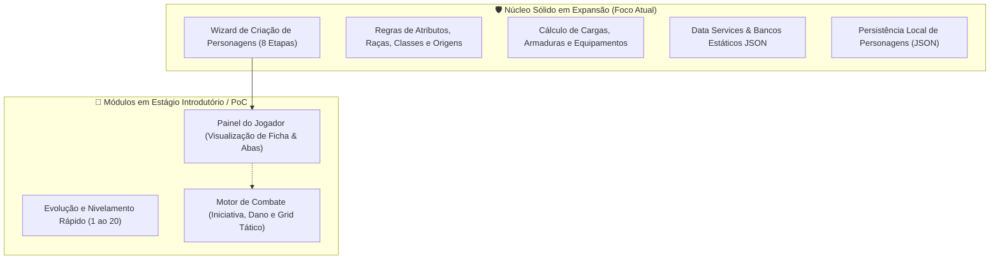

# Estado Atual do Projeto: T20 Creator (Criador de Heróis)

> **Documento de Arquitetura e Visão Técnica do Sistema**  
> **Versão do Sistema:** 1.0.0+1  
> **Framework:** Flutter (Dart SDK ^3.10.8)  
> **Foco Atual:** Construção e consolidação sólida da **Criação de Personagem**  
> **Módulos em Estágio Introdutório:** **Painel do Jogador** e **Modo de Combate**  

---

## 1. Visão Geral do Projeto

O **T20 Creator** é um aplicativo mobile/multiplataforma desenvolvido em Flutter destinado a jogadores e mestres do sistema de RPG **Tormenta 20 (T20 Edição Jogo do Ano)**. O software busca oferecer uma experiência fluida, automatizada e estritamente aderente às regras oficiais do livro básico para a criação, gerenciamento de fichas e testes mecânicos de heróis de Arton.

### 1.1. Status Atual de Maturação dos Módulos



* **Criação de Personagem (Foco Principal e Sólido):** É o centro gravitacional do desenvolvimento atual. O fluxo guia o usuário por um processo de 8 etapas completas com validações estritas de regras (atributos por compra ou rolagem, raças com habilidades e modificadores flexíveis, 14 classes oficiais com suas particularidades, perícias calculadas com inteligência, todas as origens oficiais, divindades do Panteão, e regras completas de equipamento inicial e carga).
* **Painel do Jogador (Estágio Introdutório):** Desenvolvido como tela de visualização e manipulação da ficha do personagem gerado. Possui abas estruturadas (Geral, Combate, Habilidades, Magias, Inventário, História) e suporte a controle de nível, mas ainda atua como interface introdutória para navegação da ficha antes de receber integrações complexas como diário de campanha e gestão aprofundada de inventário.
* **Modo de Combate (Estágio Introdutório / Prova de Conceito):** Criado como módulo de testes mecânicos e demonstração. Implementa um motor de iniciativa com desempates do sistema T20, combate em turnos com testes de ataque contra Defesa, cálculo de dano e margem de ameaça/crítico, estados de vida, e um protótipo de grid tático para validação de movimentação e alcance.

---

## 2. Decisões Arquiteturais e Padrões de Projeto

A arquitetura do projeto é baseada em uma versão adaptada da **Clean Architecture**, priorizando separação de responsabilidades, testabilidade e imutabilidade de estado.

```
lib/
├── main.dart                          # Ponto de entrada, boot de dados e injeção de BLoCs
├── domain/                            # Camada de Domínio e Regras Puras
│   ├── entities/                      # Modelos de dados imutáveis (Personagem, Raca, Classe...)
│   │   └── combate/                   # Entidades do módulo de combate tático
│   ├── services/                      # Regras de negócio puras (combate, carga, atributos)
│   │   └── data_services/             # Loaders assíncronos dos catálogos JSON
│   └── validators/                    # Validadores especializados de regras e pré-requisitos
├── presentation/                      # Camada de Apresentação e Estado da UI
│   ├── controllers/                   # Cubits do flutter_bloc (PersonagemCubit, HomeCubit...)
│   ├── screens/                       # Telas e páginas do Wizard de criação e painel
│   └── widgets/                       # Componentes reutilizáveis de interface
└── helpers/                           # Utilitários de interface e recursos
```

### 2.1. Gestão de Estado: BLoC / Cubit (`flutter_bloc`)

Adotou-se o **Cubit** como padrão reativo devido à sua simplicidade previsível e menor boilerplate comparado a eventos tradicionais do BLoC:
1. **`PersonagemCubit` (`personagem_cubit.dart`):**  
   Controla todo o fluxo do assistente de criação (`CharacterCreatorScreen`). Armazena o estado rascunho do herói (`PersonagemState`), a etapa atual do PageView (0 a 7), histórico de transições para suporte a voltar etapas via botão e `PopScope`, validações parciais por tela, e alocação dinâmica de pontos e bônus.
2. **`HomeCubit` (`home_cubit.dart`):**  
   Mantido no topo da árvore de componentes (`MultiBlocProvider` global) para gerenciar a listagem de personagens salvos pelo usuário, permitindo criação de novos heróis, abertura de ficha e exclusão.
3. **`CombateCubit` (`combate_cubit.dart`):**  
   Gerencia a máquina de estados do combate (`CombateState`), controlando a fila ordenada de iniciativa, turnos ativos, vida dos combatentes em tempo real, logs textuais da batalha e histórico de posições no grid.
4. **`EvolucaoCubit` (`evolucao_cubit.dart`):**  
   Controla a subida de níveis de 1 a 20 e gerencia pendências de escolha de poderes de classe.

### 2.2. Boot Assíncrono de Dados Estáticos (`data_services`)

Em vez de dispersar o carregamento de arquivos JSON ou manter bancos estáticos hardcoded gigantescos no código Dart, o projeto isolou todo o conhecimento estático do livro de Tormenta 20 em arquivos JSON na pasta `assets/data/`.

No boot do aplicativo (`main.dart`), todos os carregadores são executados em paralelo/sequência antes de inflar o widget raiz (`runApp`):
* `BancoDeRacas.carregar()`
* `BancoDeClasses.carregar()`
* `BancoDeOrigens.carregar()`
* `BancoDePoderes.carregar()`
* `BancoDeArmas.carregar()`
* `BancoDeArmaduras.carregar()`
* `BancoDeDivindades.carregar()`
* `BancoDeFormasSelvagens.carregar()`, `BancoDeCompanheiros.carregar()`, etc.

**Vantagens da Abordagem:**
* Separação limpa entre dados do livro e código de aplicação.
* Acesso em memória síncrono ultra-rápido durante todo o ciclo de vida do app após o carregamento inicial.
* Facilidade para adicionar expansões oficiais, suplementos (Ameaças de Arton, Atlas de Arton) ou homebrews sem refatorar código de UI.

### 2.3. Imutabilidade e Entidades com `copyWith`

Todas as entidades (`Personagem`, `Classe`, `Raca`, `Origem`, `Arma`, `Combatente`, etc.) são estruturadas como classes imutáveis com suporte a clonagem modificada via `copyWith`.  
Isso garante integridade nos estados emitidos pelo Cubit, evitando mutações acidentais de referências compartilhadas entre telas.

### 2.4. Persistência de Dados em Arquivos JSON

A persistência de fichas é realizada pelo `PersonagemStorageService`, utilizando a biblioteca `path_provider` para gravar e recuperar fichas no diretório de documentos do dispositivo (`getApplicationDocumentsDirectory`):
* Cada personagem salvo gera um arquivo individual estruturado em formato JSON.
* A camada de serialização converte classes de domínio complexas com suas seleções específicas de poderes, inventário e modificadores.

---

## 3. O Núcleo Sólido: Wizard de Criação de Personagem

O fluxo de criação é implementado em `CharacterCreatorScreen` e dividido em 8 etapas encadeadas com validação progressiva:

```
[Etapa 0: Atributos] 
    └──> [Etapa 1: Raça] 
             └──> [Etapa 2: Classe] 
                      └──> [Etapa 3: Perícias] 
                               └──> [Etapa 4: Origem] 
                                        └──> [Etapa 5: Divindade] 
                                                 └──> [Etapa 6: Equipamento] 
                                                          └──> [Etapa 7: Finalização]
```

### 3.1. Etapa 0: Definição de Atributos (`_PaginaAtributos`)
* **Método de Compra de Pontos:** Implementação da tabela oficial do T20 (10 pontos para distribuir; custo progressivo onde valores mais altos custam mais pontos, suportando atributos de -1 a 4 antes dos modificadores raciais).
* **Método de Rolagem:** Rolagem simulada de 4d6 descartando o menor resultado para 6 atributos, permitindo atribuição customizada aos atributos-chave.
* **Cálculo de Modificadores:** Em Tormenta 20, o valor do atributo é o seu próprio modificador (ex: Força 3 confere +3 nas rolagens).

### 3.2. Etapa 1: Escolha de Raça (`PaginaSelecaoRaca`)
* **Catálogo:** 18 raças completas de Tormenta 20 com artes e ilustrações vetoriais em SVG (`assets/icons/racas/`).
* **Regras Específicas:**
  * Modificadores fixos (ex: Anão com +2 CON, +1 SAB, -1 DES).
  * Raças com bônus flexíveis livres (ex: Humano com +1 em três atributos distintos; Lefou com +1 em três atributos exceto Carisma).
  * Bloqueios de atributos (ex: Osteon não pode receber bônus em Constituição).
  * Exibição detalhada de habilidades raciais com seus textos descritivos oficiais.

### 3.3. Etapa 2: Escolha de Classe (`PaginaSelecaoClasse`)
* **Catálogo:** As 14 classes oficiais do livro básico (Arcanista, Bárbaro, Bardo, Bucaneiro, Caçador, Cavaleiro, Clérigo, Druida, Guerreiro, Inventor, Ladino, Lutador, Nobre, Paladino) com ícones em SVG (`assets/icons/classes/`).
* **Automação de Estatísticas:** PV Inicial somado com modificador de Constituição, PM Inicial somado com atributo-chave.
* **Subsistemas Específicos por Classe já integrados:**
  * **Arcanista:** Escolha de Caminho (Bruxo com foco, Feiticeiro com linhagem e Mago com grimório) e Linhagens (Dracônica, Feérica, Rubra).
  * **Guerreiro:** Mecânica e catálogo de Golpe Pessoal.
  * **Inventor:** Regras e cálculos para fabricação de Engenhocas.
  * **Druida:** Seleção e tipos de Companheiro Animal e Formas Selvagens.
  * **Cavaleiro:** Subsistema de Montaria Sagrada.

### 3.4. Etapa 3: Escolha de Perícias (`PaginaSelecaoPericias`)
* **Perícias Automáticas:** Adicionadas diretamente conforme o pacote da classe.
* **Perícias de Escolha da Classe:** Seleção da cota específica de perícias da lista de classe.
* **Perícias Bônus de Inteligência:** Se o herói possui Inteligência positiva, ganha perícias adicionais livres dentre todas as perícias gerais do jogo.

### 3.5. Etapa 4: Escolha de Origem (`PaginaSelecaoOrigem`)
* Todas as origens do livro do jogador devidamente catalogadas no `banco_origens.json`.
* O jogador escolhe os benefícios concedidos pela origem: combinação de perícias treinadas e poderes gerais/de origem, além de itens e equipamentos iniciais temáticos.

### 3.6. Etapa 5: Escolha de Divindade e Devoção (`PaginaSelecaoDivindade`)
* **Catálogo Dinâmico e Opção Livre:** Catálogo das divindades do Panteão carregado a partir de `assets/data/deuses/banco_deuses.json` via `BancoDeDivindades` (`call_divindades.dart`), com suporte completo à opção "Não Devoto".
* **Devotos Fiéis vs. Devotos Comuns (Regra Ajustada):**
  * *Devotos Fiéis (Clérigo, Druida, Paladino):* Escolhem **2 poderes concedidos** de sua divindade patrona.
  * *Devotos Comuns (demais classes):* Escolhem exatamente **1 poder concedido**.
* **Validação de Elegibilidade Oficial e Modo Estrito/Livre:**
  * Paladinos e Druidas respeitam as restrições canônicas de divindade no Modo Estrito (com botão de alternância para Modo Livre/Homebrew na interface).
* **Canalização de Energia:** Opções de energia Positiva, Negativa ou à escolha (com seleção obrigatória na interface para divindades flexíveis).
* **Validação de Pré-requisitos:** Checagem rigorosa de requisitos de poderes concedidos (como proficiências e atributos).
* **Mecânica de Punição Divina:**
  * O Mestre pode acionar Punição Divina diretamente no Painel do Jogador, o que zera o PM atual, bloqueia a recuperação de pontos de mana e desativa os poderes concedidos até que uma penitência seja cumprida.
* **Persistência Completa:** Armazenamento de ID da divindade, chaves dos poderes concedidos, energia canalizada e status de punição divina no JSON local.

### 3.7. Etapa 6: Equipamento Inicial e Carga (`PaginaSelecaoEquipamento`)
* Catálogo de armas simples, marciais, exóticas, armaduras leves, pesadas e escudos via `BancoDeArmas` e `BancoDeArmaduras`.
* **Motor de Carga (`regras_carga_service.dart`):** Cálculo dinâmico de espaços e peso suportado com base no valor de Força e armaduras equipadas.
* Cálculo automático de **Penalidade de Armadura** para aplicação em perícias de Destreza e Força.

### 3.8. Etapa 7: Finalização e Identidade
* Atribuição de nome, bio, e inserção de imagem de avatar através da galeria ou câmera via `image_picker`.
* Resumo completo dos atributos finais calculados (Base + Raça + Origem).
* Salvamento atômico no armazenamento local via `PersonagemStorageService`.

---

## 4. Módulos Introdutórios e Protótipos

Conforme diretriz do projeto, estes módulos foram criados como introdução, validação de interface e laboratório de mecânicas:

### 4.1. Painel do Jogador (`painel_jogador_screen.dart`)

O Painel do Jogador funciona como o "hub central" da ficha de um personagem já salvo:

* **Arquitetura Visual:** Implementado com um `TabController` contendo 6 abas principais:
  1. **Geral:** Exibição do cartão do personagem, barras de PV e PM com controles de dano e cura em tempo real, defesas, atributos finais e atalhos rápidos.
  2. **Combate:** Ponto de transição e visualização rápida de armas empunhadas e iniciativa.
  3. **Habilidades:** Listagem de todas as habilidades raciais, de classe e poderes gerais adquiridos.
  4. **Magias:** Estrutura pronta para listar magias e círculos para conjuradores.
  5. **Inventário:** Controle de itens carregados, armas, proteções e monitoramento de carga.
  6. **História:** Origem, divindade, crenças e anotações biográficas.
* **Controle de Nível Introdutório:** Permite avançar ou regredir o nível do personagem (1 ao 20) com recálculo imediato de PV e PM máximos e notificação de poderes de classe pendentes para seleção através de `selecao_poderes_screen.dart`.

### 4.2. Módulo de Combate (`aba_combate_view.dart` & `combate_engine.dart`)

O modo de combate foi desenhado para testar as mecânicas numéricas do T20 e fornecer uma experiência tática interativa:

#### Motor de Regras (`CombateEngine`):
* **Iniciativa T20:** Rola `1d20 + modificador de iniciativa` para todos os participantes (jogadores e monstros). Aplica as 3 regras de desempate do livro oficial:
  1. Maior valor total rolado;
  2. Maior bônus da perícia Iniciativa;
  3. Rolagem extra de desempate em caso de persistência.
* **Atraso de Iniciativa:** Regra oficial que permite atrasar a vez até um limite negativo relativo ao bônus.
* **Resolução de Ataques (`resultado_ataque.dart`):**
  * Verificação de Acerto Crítico (natural 20 ou atingir a margem de ameaça da arma).
  * Erro Crítico (natural 1).
  * Comparação com a Defesa do alvo (`ataqueTotal >= defesaAlvo`).
  * Rolagem de dano com multiplicador de crítico (ex: x2, x3) e soma de atributos.
  * Aplicação de Redução de Dano (RD) e atualização de status de saúde (`Normal`, `Inconsciente`, `Sangrando`, `Derrotado`).

#### Grid Tático e Movimentação (`GridTatico` & `MovimentoEngine`):
* Representação bidimensional em matriz de quadrados de 1,5m (padrão T20).
* Verificação de deslocamento máximo baseado na raça e condições de terreno.
* Cálculo de distâncias (alcance adjacente corpo a corpo vs alcance curto, médio e longo para disparos).
* Suporte a inimigos de teste (`inimigos_treino.dart`) para simulação de encontros.

---

## 5. Estrutura do Catálogo de Dados (`assets/`)

Os dados do jogo são centralizados em arquivos JSON padronizados:

| Diretório / Arquivo | Conteúdo |
| :--- | :--- |
| `assets/data/banco_racas.json` | 18 raças completas, habilidades, modificadores e regras de flexibilidade |
| `assets/data/deuses/banco_deuses.json` | Catálogo do Panteão, crenças, símbolos, canalização, armas e poderes concedidos |
| `assets/data/classes_data/banco_classe.json` | 14 classes, progressão de PV/PM, proficiências e habilidades de classe |
| `assets/data/banco_origens.json` | Todas as origens oficiais, perícias elegíveis, poderes e itens iniciais |
| `assets/data/classes_data/banco_poderes_classe.json` | Banco de poderes de classe com pré-requisitos de nível, atributos e pericias |
| `assets/data/equipment/banco_armas.json` | Armas simples, marciais, exóticas, dados de dano, crítico e alcance |
| `assets/data/equipment/banco_armaduras.json` | Armaduras leves, pesadas, escudos, bônus de defesa e penalidades |
| `assets/data/classes_data/especifico_classe/` | Dados especializados (Golpes Pessoais, Engenhocas, Formas Selvagens, Montarias) |
| `assets/icons/racas/` | Ícones vetoriais SVG de cada raça |
| `assets/icons/classes/` | Ícones vetoriais SVG de cada classe |

---

## 6. Próximos Passos e Prioridades de Desenvolvimento

Com o objetivo de manter a criação de personagens como o alicerce principal antes da evolução total dos demais módulos:

1. **Consolidação Final da Criação:**
   * Implementação da seleção de magias de 1º círculo no próprio fluxo de criação para classes conjuradoras (Arcanista, Bardo, Clérigo, Druida).
   * Expansão futura do catálogo de divindades para os 20 deuses maiores via arquivo JSON dedicado (`banco_divindades.json`).
   * Exportação e compartilhamento de fichas (exportação em PDF ou compartilhamento em JSON).
2. **Evolução Gradual dos Módulos Introdutórios:**
   * **Do Painel do Jogador:** Conectar a manipulação de itens do inventário (equipar/desequipar alterando Defesa e Carga em tempo real) e diário de magias com gasto de PM.
   * **Do Módulo de Combate:** Adicionar condições de combate (Abalado, Caído, Cego, Flanqueado), manobras de combate (Derrubar, Desarmar, Empurrar) e suporte a magias na engine.
